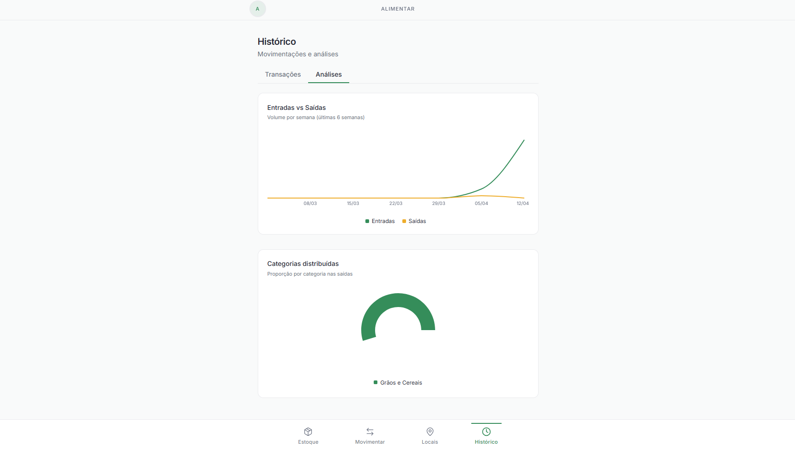
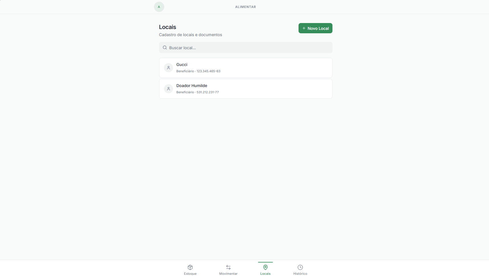
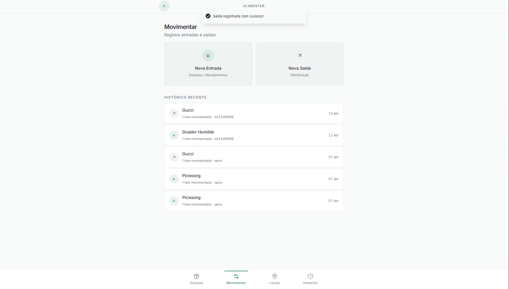
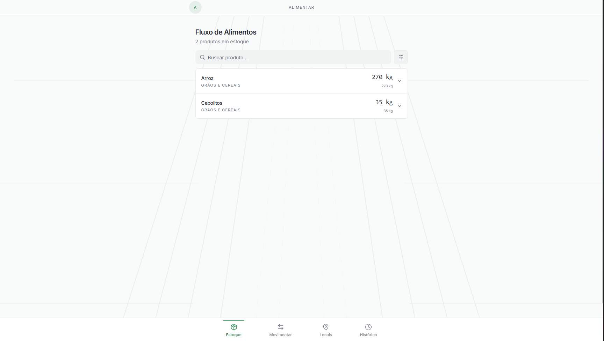

# 📦 Sistema de Gestão de Banco de Alimentos

Aplicação web desenvolvida para auxiliar **ONGs e instituições sociais** no controle de entrada e saída de alimentos, promovendo organização de estoque, rastreabilidade e redução de desperdícios.

O sistema permite registrar doações recebidas, controlar lotes com datas de validade, registrar distribuições e visualizar indicadores consolidados por meio de um **painel simples e intuitivo**.

---

# 🎯 Sobre a Aplicação

Instituições sociais frequentemente recebem grandes volumes de doações, mas enfrentam dificuldades na **organização e controle de validade dos produtos**.

Este sistema foi desenvolvido para ajudar essas instituições a:

* organizar o estoque por **lotes**
* priorizar a saída de alimentos com **validade mais próxima**
* emitir **alertas visuais de vencimento**
* manter **histórico completo de movimentações**
* fornecer uma **visão geral do estoque através de um dashboard**

A aplicação foi pensada para ser **simples, objetiva e otimizada para uso em dispositivos móveis**.

---

# 🏗️ Arquitetura do Sistema

O projeto está dividido em duas partes principais:

```
sistema-gestao-banco-alimentos
│
├── backend   → API responsável pela lógica de negócio e acesso ao banco
│
└── frontend  → Interface web utilizada pelos usuários
```

* O **backend** fornece uma API REST responsável por autenticação, gerenciamento de produtos, categorias e movimentações.
* O **frontend** consome essa API e apresenta as informações ao usuário através de uma interface web.

---

# 🛠️ Tecnologias Utilizadas

## 🔹 Back-end

* Python
* FastAPI
* SQLAlchemy
* PostgreSQL
* Uvicorn
* JWT para autenticação

---

## 🔹 Front-end

* React
* Vite
* TypeScript
* TailwindCSS

---

# 📂 Estrutura do Repositório

```
sistema-gestao-banco-alimentos
│
├── backend
│   └── API da aplicação
│
├── frontend
│   └── Interface web do sistema
│
└── README.md
```

---

# ⚙️ Como Rodar o Projeto

O projeto é dividido em **backend e frontend**.

Cada parte possui seu próprio README com instruções detalhadas.

### Backend

Veja instruções completas em:

```
backend/README.md
```

### Frontend

Veja instruções completas em:

```
frontend/README.md
```

---

# 🚀 Funcionalidades Principais

* Cadastro de usuários
* Autenticação com JWT
* Gerenciamento de produtos
* Controle de categorias
* Controle de estoque por lote
* Registro de movimentações de entrada e saída
* Visualização de indicadores em dashboard

---

# 🖼️ Screenshots da Aplicação

## Histórico e análises



## Locais



## Movimentações



## Estoque



---

# 📌 Objetivo do Projeto

Este projeto foi desenvolvido com fins **acadêmicos e de aprendizado**, com foco em:

* desenvolvimento de APIs com FastAPI
* construção de aplicações web com React
* integração entre front-end e back-end
* boas práticas de organização de projetos

---
